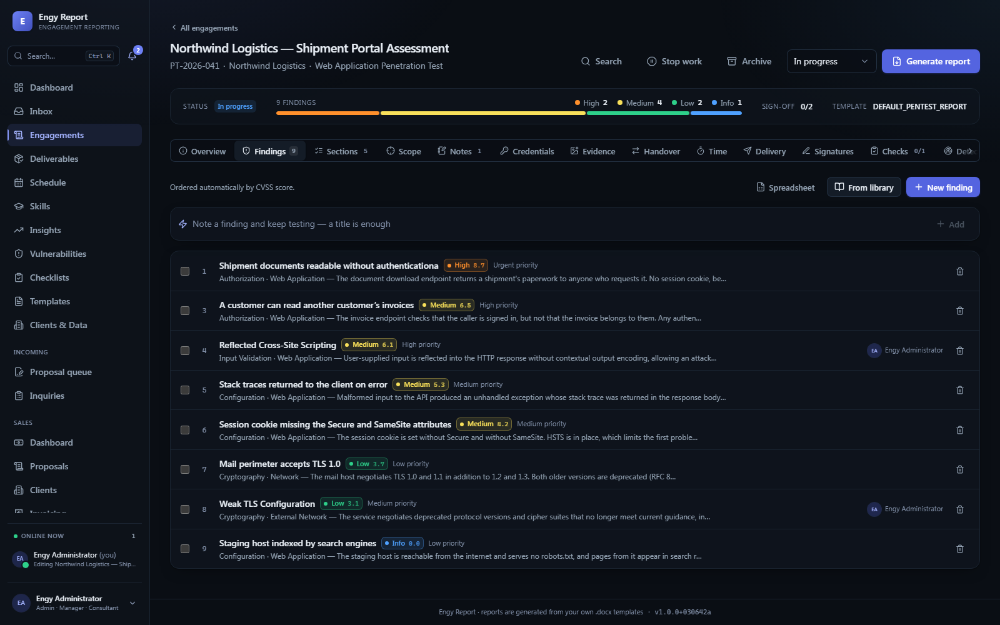
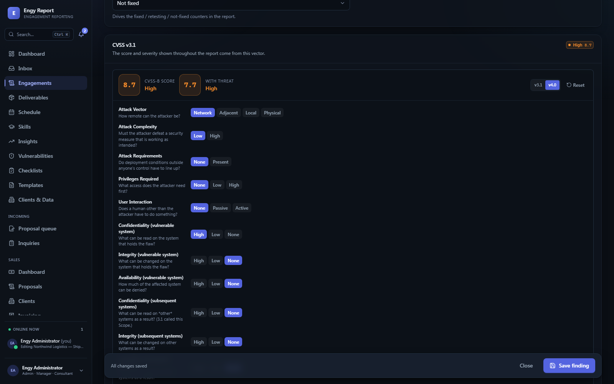
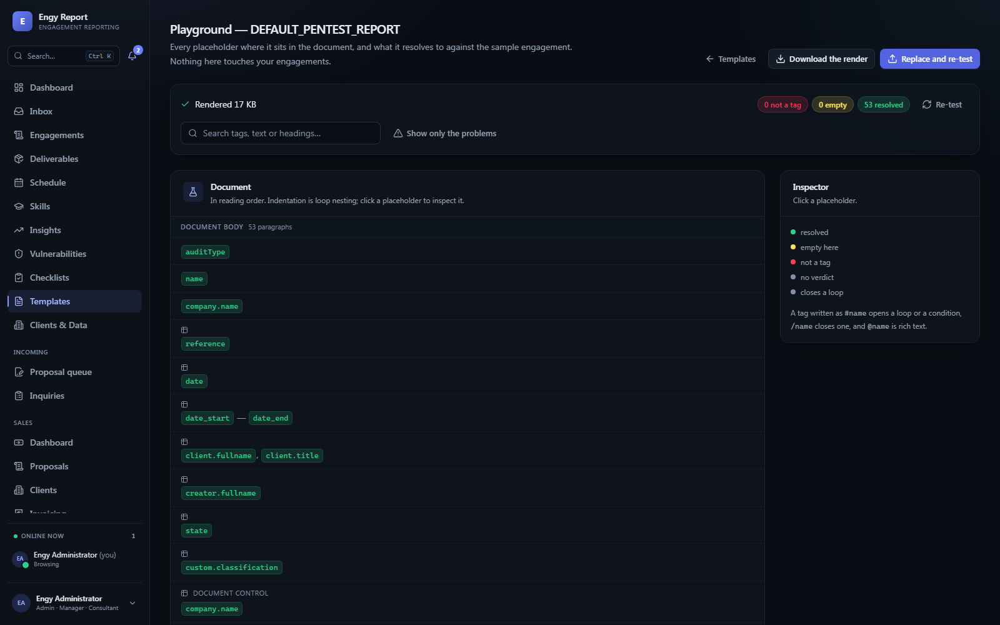
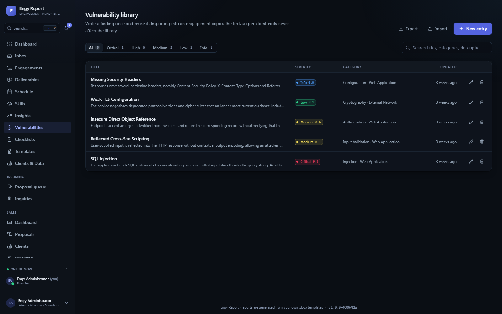
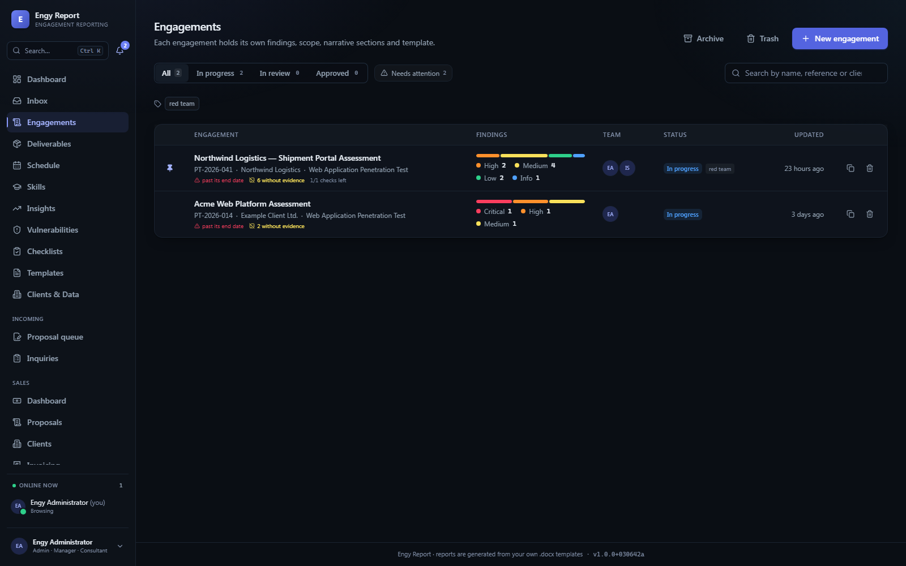
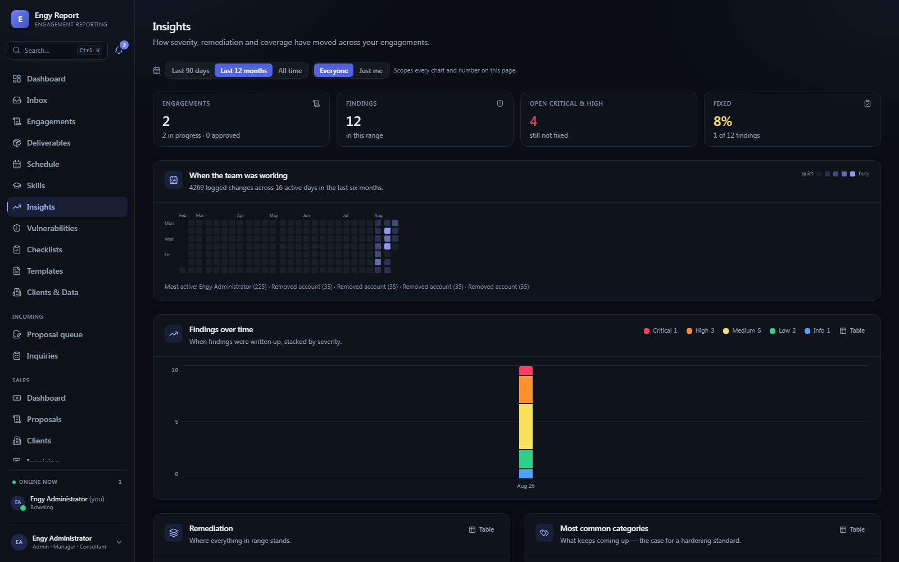

<h1 align="center">
  <br>
  Engy Report
</h1>

<h4 align="center">A pentest reporting platform that fills <em>your own</em> Word template.<br>You write the findings. It writes the document.</h4>

<div align="center">

     

</div>

<div align="center">

[Quick start](#quick-start) &nbsp;•&nbsp; [Docker](#run-it-with-docker) &nbsp;•&nbsp; [Documentation](#documentation) &nbsp;•&nbsp; [Template language](docs/src/content/template-language.md) &nbsp;•&nbsp; [Screenshots](#a-look-around)

</div>

---

📄 **Your `.docx` is the design.** Cover page, fonts, headers, tables, numbering — all from your template. None of it lives in the code.<br>
✍️ **Write a finding once.** Keep it in the library, pull it into any engagement, edit it there without touching the original.<br>
🧮 **CVSS 3.1 and 4.0**, scored in the app, with the threat and environmental metrics.<br>
🤝 **Several people, one engagement** — presence, finding locks, review threads, approvals.<br>
🐳 **One command to run it**, on a machine with neither Node nor MongoDB installed.

<br>

## A look around

<p align="center">
  
</p>
<p align="center"><em>Findings order themselves by score, or by hand. Severity, category, author and evidence at a glance.</em></p>

<br>

<table>
<tr>
<td width="50%"></td>
<td width="50%"></td>
</tr>
<tr>
<td><b>Score it in place.</b> Both CVSS versions, every metric explained in a sentence, base and threat scores as you click.</td>
<td><b>Test a template before you trust it.</b> Every placeholder in reading order, what it resolved to, and which ones are not tags at all.</td>
</tr>
<tr>
<td width="50%"></td>
<td width="50%"></td>
</tr>
<tr>
<td><b>A library, not a copy-paste folder.</b> Importing copies the text, so per-client edits never leak back.</td>
<td><b>Every engagement, with what it still needs.</b> Findings without evidence, checks left, sign-offs outstanding.</td>
</tr>
<tr>
<td colspan="2"></td>
</tr>
<tr>
<td colspan="2"><b>Across all of it.</b> Severity over time, remediation, what keeps coming up — the case for a hardening standard.</td>
</tr>
</table>

<br>

## Quick start

Needs **Node 20.19+** and a **MongoDB** you can reach.

```bash
npm install
cp .env.example .env
npm run seed              # database, admin account, reference data
npm run make:template     # writes DEFAULT_PENTEST_REPORT.docx
npm run dev               # API on :4000, app on :5173
```

Open **http://localhost:5173**, sign in as `admin` / `Admin123!`, and change it on the Profile page.

Then: **Templates** → upload `DEFAULT_PENTEST_REPORT.docx` → **Engagements** → New → add findings → **Generate report**.

> [!TIP]
> `npm run seed:demo` builds a finished engagement — findings with evidence, a part-worked
> methodology, a review conversation — so the pages have something in them while you look around.

## Run it with Docker

For a machine that has neither Node nor MongoDB on it. Everything comes with it, and nothing is installed outside Docker.

```bash
docker compose up -d --build
```

- **http://localhost:4000** — the app
- **http://localhost:4100** — the documentation

The bundled MongoDB is not published to the host, so it will not collide with one you already run. Data lives in two named volumes and survives `docker compose down`. Real JWT and vault secrets are generated on first boot, so nothing secret sits in `docker-compose.yml`.

## Writing a template

A template is an ordinary Word document with placeholders in it. Spacing inside the braces never matters, and the leading dot is optional.

```
{{ .name }}                         Engagement name
{{ .company.name }}                 Client
{{ .date | date:'dd/MM/yyyy' }}     A filter
{{@rich.executiveSummary}}          Rich text: headings, lists, tables, images

{{#findings}}                       Loop
  {{ .id }} — {{ .title }} ({{ .severity }})
  {{@rich.description}}
{{/findings}}

{{#hasDetection}} … {{/hasDetection}}    Conditional block
```

**The complete list is in the app: Templates → Tag reference** — searchable, with copy-to-clipboard, generated from the same source the renderer uses so it cannot drift.

Rich text maps onto Word's built-in styles rather than hard-coded formatting, which is what makes the output match your design. Your template needs `Heading1`–`Heading6`, `ListParagraph`, `Quote` and `Caption` to exist.

## Documentation

Twenty pages with their own search, as a third workspace in this repo:

```bash
npm run docs        # http://localhost:5175
```

| | |
| --- | --- |
| [Installing and running it](docs/src/content/installation.md) | Node, MongoDB, the first account |
| [Running it with Docker](docs/src/content/docker.md) | Volumes, secrets, backups |
| [Your first report](docs/src/content/first-report.md) | Engagement to document in about ten minutes |
| [The template language](docs/src/content/template-language.md) | Every tag and filter, and the traps |
| [One house style](docs/src/content/house-style.md) | Letterheads and inheritance across templates |
| [Working together](docs/src/content/working-together.md) | Presence, locks, reviews, approvals |
| [Operations and maintenance](docs/src/content/operations.md) | Backups, housekeeping, the scripts |

## Checking it works

Four suites, all against a real database:

```bash
npm run test:tags     # the template language and the OOXML it produces
npm run test:collab   # the API end to end, as several people at once
npm run test:media    # evidence, storage and the render cache
npm run smoke         # a rendered report, every page, the docs, WCAG contrast
```

They create everything they need under a `zz-` prefix and remove it afterwards.

---

<div align="center">
<sub>Design decisions live in comments beside the code they explain. <code>git log</code> is the long-form version of this file.</sub>
</div>
